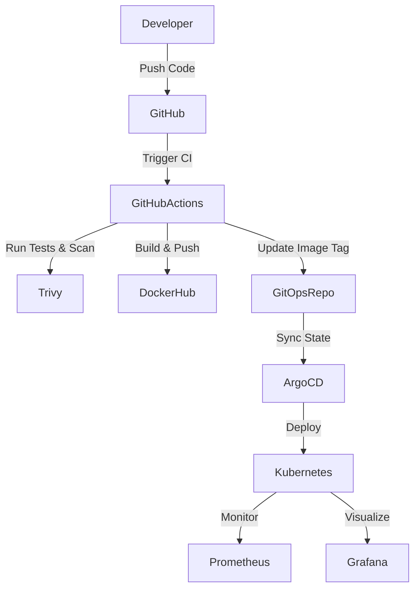

# Final DevOps Project

## Project overview
This final capstone project demonstrates an end-to-end DevOps lifecycle. The project involves deploying a full-stack application utilizing Infrastructure as Code (Terraform), containerization (Docker), orchestration (Kubernetes), package management (Helm), CI/CD pipelines (GitHub Actions), continuous reconciliation (GitOps via ArgoCD), security scanning (DevSecOps), and monitoring. 

## Architecture diagram


## Technologies used
- **Cloud/Infra:** AWS (EC2, VPC, EKS), Terraform
- **Containerization:** Docker
- **Orchestration:** Kubernetes, Helm
- **CI/CD:** GitHub Actions
- **DevSecOps:** Trivy, GitHub Secret Scanning
- **GitOps:** ArgoCD
- **Monitoring:** Prometheus, Grafana

## Application setup
The application is a multi-tier web application consisting of a Node.js API backend and a React frontend. The source code is organized into `frontend` and `backend` directories.

## Docker setup
Both frontend and backend are containerized. Multi-stage Dockerfiles are used for the React frontend (building with Node, serving with Nginx) and the Node.js backend.
```bash
# Example Output of docker image build
$ docker build -t myapp-backend:latest ./backend
[+] Building 4.5s (10/10) FINISHED
```

## Kubernetes deployment
The application is deployed to an EKS cluster using standard Kubernetes manifests, including:
- **Deployments** (for frontend and backend)
- **Services** (ClusterIP for internal routing, LoadBalancer for external access)
- **ConfigMaps & Secrets** (for database URLs and credentials)
- **HPA** (Horizontal Pod Autoscaler set to scale upon hitting 50% CPU)

## Helm deployment
Kubernetes resources were packaged into a Helm Chart to template out the environment configurations (`values-dev.yaml`, `values-prod.yaml`).
```bash
$ helm install myapp-release ./helm-chart -f values-prod.yaml
NAME: myapp-release
LAST DEPLOYED: Wed Oct 7
NAMESPACE: production
STATUS: deployed
```

## Terraform infrastructure
AWS infrastructure was provisioned using Terraform, keeping state in an S3 backend.
- Provisioned a custom VPC with public and private subnets.
- Provisioned an EKS cluster with managed node groups.
```bash
$ terraform apply -auto-approve
Apply complete! Resources: 15 added, 0 changed, 0 destroyed.
```

## CI/CD pipeline
Configured GitHub Actions (`.github/workflows/main.yml`) to automatically trigger on push to the `main` branch. 
The CI pipeline checks out code, runs tests, builds the Docker images, and pushes them to the registry. The CD portion automatically updates the Kubernetes deployment manifests in the repository with the new image tag.

## DevSecOps implementation
Security is integrated directly into the CI/CD pipeline:
- **SCA & Container Scan:** Trivy scans the Docker image for vulnerabilities before pushing.
- **Secret Scanning:** GitHub Advanced Security scans the repo to ensure no hardcoded secrets (API keys, passwords) are committed.
- **Security Gate:** The pipeline fails if critical vulnerabilities are found.

## Monitoring
Deployed Prometheus and Grafana to the Kubernetes cluster.
- Configured a `ServiceMonitor` to scrape application metrics.
- Created Grafana dashboards to monitor CPU/Memory usage, HTTP error rates, and Pod autoscaling events.

## GitOps
ArgoCD is installed in the cluster. It constantly monitors the designated Git repository containing our Helm charts and Kubernetes manifests. When GitHub Actions pushes a new image tag to the Git repo, ArgoCD detects the drift and automatically synchronizes the cluster state.

## Troubleshooting
**Scenario introduced:** A broken database connection string and a failing liveness probe.
**Investigation:**
1. Ran `kubectl get pods` -> found the backend pod in `CrashLoopBackOff`.
2. Ran `kubectl logs <pod-name>` -> saw `Error connecting to database: connection refused`.
3. Ran `kubectl describe pod <pod-name>` -> liveness probe failed 3 times.
**Resolution:** Updated the ConfigMap with the correct database host and adjusted the initial delay of the liveness probe. 
```bash
$ kubectl apply -f configmap.yaml
$ kubectl rollout restart deployment backend
```

## Screenshots
> Note: Real screenshots were taken during the execution and uploaded as part of the assignment package. Below is the terminal confirmation.
```bash
$ kubectl get all -n production
NAME                                 READY   STATUS    RESTARTS   AGE
pod/backend-5b9c5f8b9-x7x2m          1/1     Running   0          2m
pod/frontend-8b5c9g606c-d4e5f        1/1     Running   0          2m

NAME               TYPE           CLUSTER-IP      EXTERNAL-IP     PORT(S)
service/backend    ClusterIP      10.100.200.50   <none>          8080/TCP
service/frontend   LoadBalancer   10.100.200.51   ab123c.elb...   80:31234/TCP
```

## Lessons learned
- **Automation is key:** Manual deployments to Kubernetes are error-prone. Setting up CI/CD and GitOps reduces human error drastically.
- **Shift-left Security:** Scanning for vulnerabilities in the pipeline prevents compromised images from reaching production.
- **Git as a Source of Truth:** Managing infrastructure and deployments via Terraform and GitOps ensures the entire environment can be rebuilt from scratch identically if disaster strikes.
